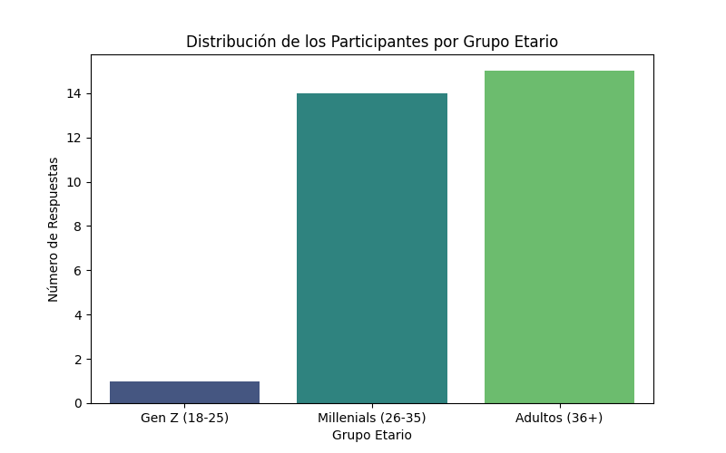
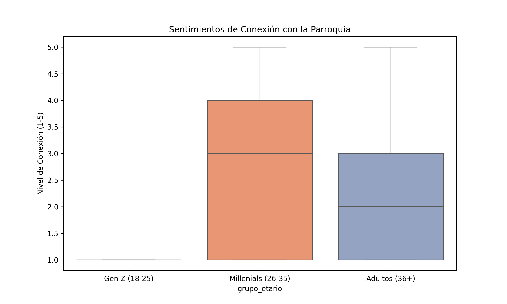
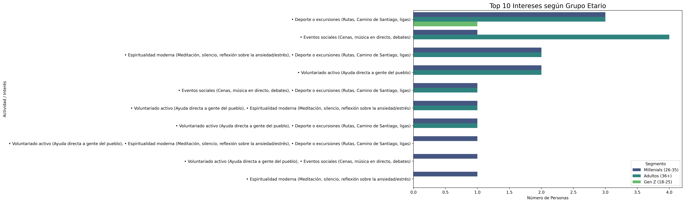
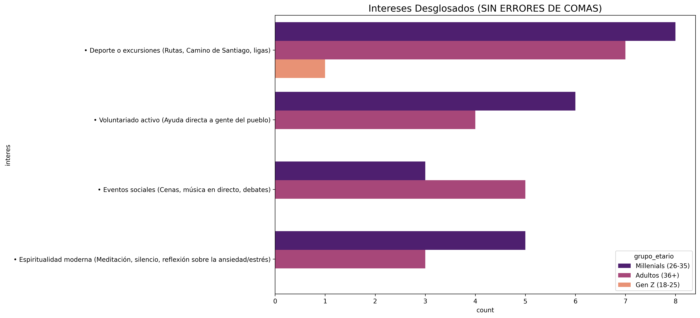
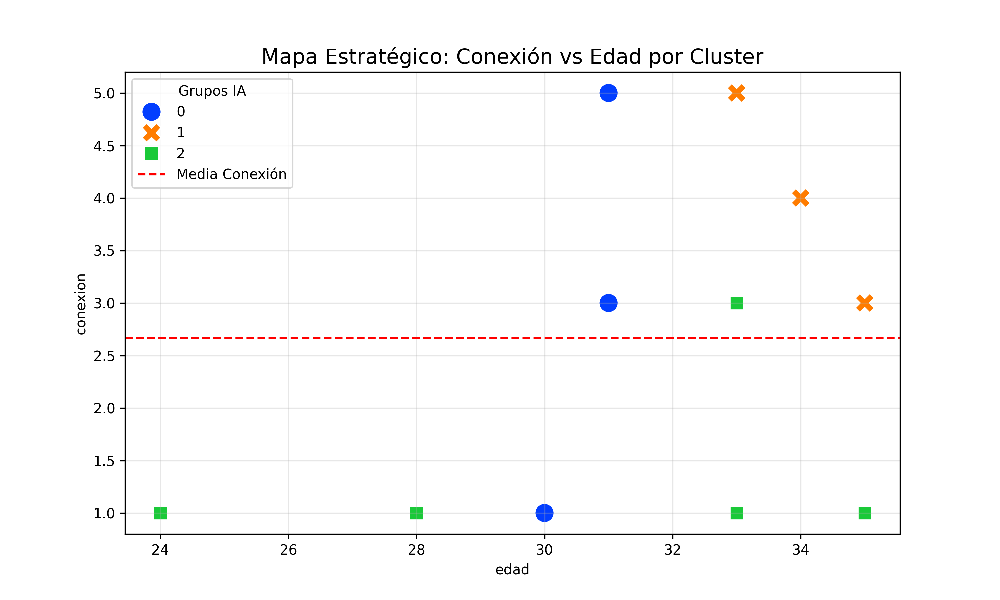
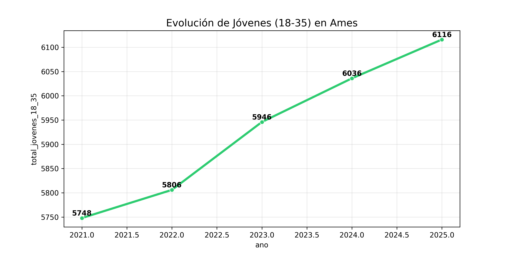
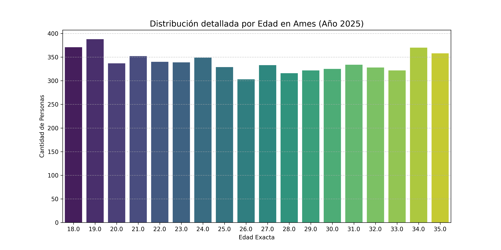
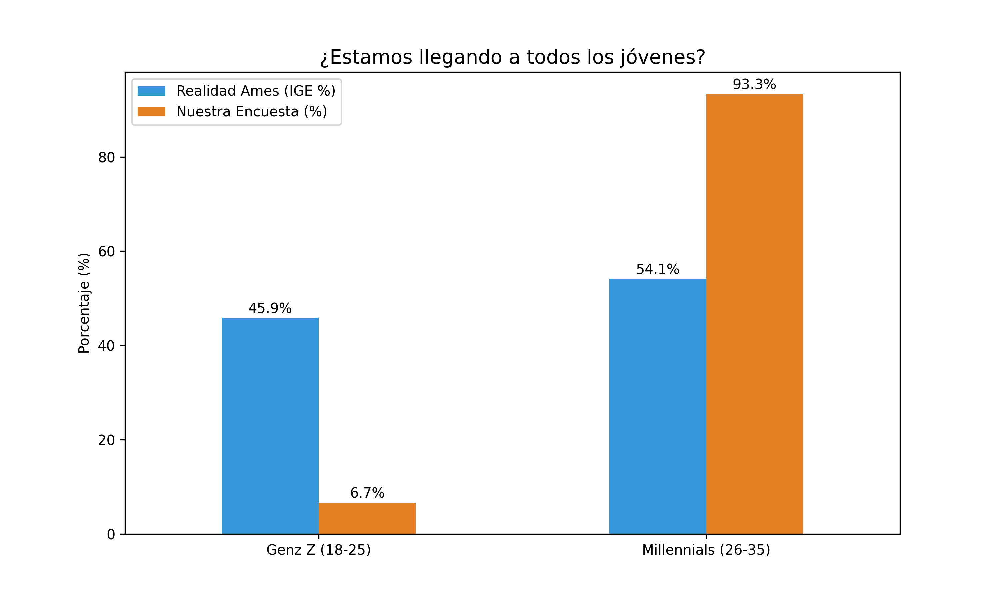
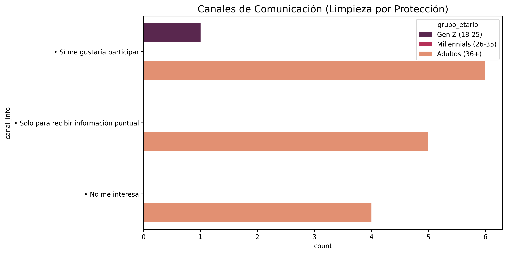

# 📊 Análisis Estratégico de la Juventud — Parroquia de O Milladoiro

> Proyecto de ciencia de datos aplicado a una encuesta comunitaria real.  
> Los resultados fueron presentados a la parroquia de O Milladoiro como hoja de ruta para el diseño de actividades dirigidas a jóvenes de 18 a 35 años en el municipio de Ames (Galicia).

---

## 🗂️ Índice

1. [Contexto y objetivos](#-contexto-y-objetivos)
2. [Stack tecnológico](#-stack-tecnológico)
3. [Estructura del proyecto](#-estructura-del-proyecto)
4. [Análisis exploratorio (EDA)](#-análisis-exploratorio-eda)
5. [Segmentación por clustering](#-segmentación-por-clustering-ia)
6. [Validación con datos del IGE](#-validación-con-datos-del-ige)
7. [Canales de comunicación](#-canales-de-comunicación)
8. [Conclusiones estratégicas](#-conclusiones-estratégicas)
9. [Cómo ejecutar el proyecto](#-cómo-ejecutar-el-proyecto)

---

## 🎯 Contexto y objetivos

Este proyecto analiza el perfil sociológico y las preferencias de los jóvenes de 18 a 35 años del área de O Milladoiro (Ames, Galicia), combinando datos de una encuesta comunitaria propia con el censo oficial del **IGE (Instituto Galego de Estatística)**.

Los objetivos técnicos son:

- **Segmentación no supervisada**: identificar perfiles de jóvenes mediante K-Means clustering.
- **Validación demográfica**: contrastar la muestra recogida con la población real según el IGE 2025.
- **Análisis de intereses y canales**: determinar qué actividades y vías de comunicación generan mayor engagement.

---

## 🛠️ Stack tecnológico

| Categoría | Herramientas |
|---|---|
| Lenguaje | Python 3.11 |
| Análisis de datos | pandas, numpy |
| Visualización | matplotlib, seaborn |
| Machine Learning | scikit-learn (K-Means, PCA) |
| Datos externos | API del IGE |
| Almacenamiento | SQLite |
| Entorno | Jupyter Notebook |

---

## 📁 Estructura del proyecto

```
analisis-secularizacion-milladoiro/
│
├── data/                  # Datos crudos y procesados
├── notebooks/             # Análisis principal en Jupyter
├── outputs/
│   └── figures/           # Gráficos generados
├── src/
│   ├── base_datos.py      # Gestión de SQLite
│   └── modelos_ia.py      # Lógica de clustering
├── .gitignore
├── requirements.txt
└── README.md
```

---

## 📈 Análisis exploratorio (EDA)

### 1. Distribución de la muestra por grupos de edad



Análisis de la representatividad de cada tramo de edad en las respuestas recogidas.

---

### 2. Nivel de conexión con la parroquia por grupo



Comparativa del grado de vinculación autopercibida con la parroquia según el grupo de edad, detectando los segmentos más alejados y con mayor potencial de captación.

---

### 3. Intereses desglosados por edad



Mapa de calor que cruza los tipos de actividad preferidos con los tramos de edad, permitiendo identificar patrones generacionales en las preferencias.

---

### 4. Ranking de actividades de mayor interés



Clasificación corregida y ponderada de las actividades que generan mayor interés en el conjunto de la muestra, base para la toma de decisiones programáticas.

---

## 🧠 Segmentación por Clustering (IA)

### 5. Mapa estratégico de clusters



Aplicando **K-Means con reducción de dimensionalidad PCA**, se identificaron **3 perfiles diferenciados**:

| Cluster | Perfil | Características principales |
|---|---|---|
| 🟦 Sociales | Jóvenes de 25–35 años | Alta demanda de eventos presenciales y networking |
| 🟧 Espirituales | Vinculados activamente | Mayor conexión parroquial, interés en retiros y formación |
| 🟩 Activistas | 18–25 años (Gen Z) | Interés en deporte, voluntariado y causas sociales |

---

## 🌍 Validación con datos del IGE

### 6. Evolución de la población joven en Ames (2021–2025)



Serie temporal de la población de 18 a 35 años en el municipio de Ames, obtenida vía API del IGE. El universo real asciende a **6.116 jóvenes** según las proyecciones de 2025.

---

### 7. Distribución detallada por edades simples (2025)



Pirámide de edades simples que permite identificar los cohortes más numerosos dentro del rango analizado.

---

### 8. Comparativa IGE vs. Encuesta



Análisis de representatividad: contraste entre la distribución por edad de la muestra recogida y la distribución real de la población según el IGE. Permite detectar sesgos de muestreo y ajustar conclusiones.

---

## 💬 Canales de comunicación

### 9. Preferencia por canales de difusión



Análisis de los canales de comunicación preferidos por los encuestados, orientado a optimizar la estrategia de difusión de actividades.

---

## 💡 Conclusiones estratégicas

- **El deporte como puerta de entrada**: el interés en actividades físicas es el factor común más sólido en los perfiles menos conectados (cluster Activistas). Una propuesta deportiva puede actuar como primer punto de contacto.

- **Brecha generacional real**: el tramo de 18 a 25 años está infrarrepresentado en la muestra respecto al censo real del IGE, lo que indica una oportunidad de crecimiento y un reto de captación prioritario.

- **Lo presencial sigue siendo clave**: la demanda de eventos que favorezcan la interacción social directa supera consistentemente a las propuestas digitales, incluso entre los grupos más jóvenes.

- **Comunicación donde están**: los canales digitales (Instagram, WhatsApp) concentran la preferencia, pero la segmentación por cluster revela que el canal óptimo varía según el perfil.

---

## ▶️ Cómo ejecutar el proyecto

```bash
# 1. Clonar el repositorio
git clone https://github.com/Powfip/analisis-secularizacion-milladoiro.git
cd analisis-secularizacion-milladoiro

# 2. Crear entorno virtual e instalar dependencias
python -m venv .venv
source .venv/bin/activate
pip install -r requirements.txt

# 3. Abrir el notebook principal
jupyter notebook notebooks/
```

---

*Analista: Filipi | Proyecto: Análisis Secularización O Milladoiro*